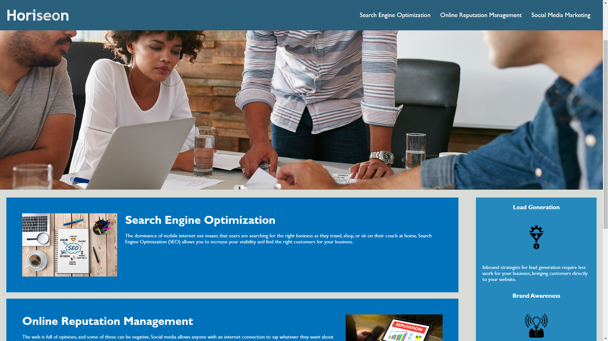

# Challenge One

## Description

This is a website for a marketing agency that follows accessibility standards
and is optimized for search engines.

## Visuals

This is the website layout:

## Link

[nanea808.github.io/first-challenge/](https://nanea808.github.io/first-challenge/)

## Installation

N/A

## Usage

This website is meant to display important info about Horiseon Social Solution Sevices. Quick navigation can be found in the top right of the website and all info is listed below.

## Credits

N/A

## License

Please refer to the LICENSE in the repo.
